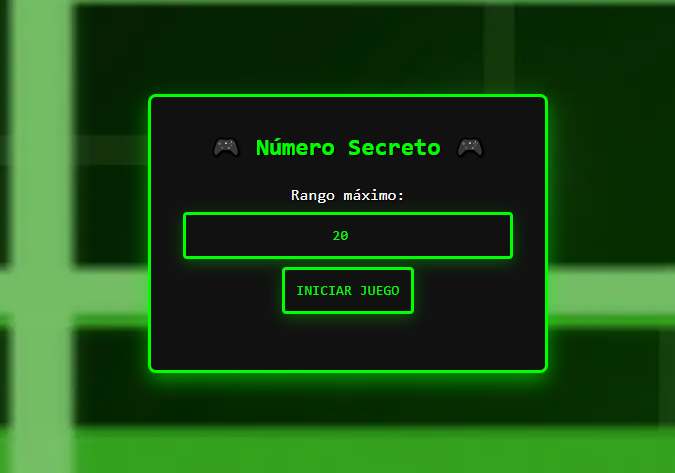

# Juego del Número Secreto 🎲

¡Adivina un número entre 1 y un máximo que puedes configurar! Este es un juego interactivo donde se genera un número secreto y tú debes intentar adivinarlo en la menor cantidad de intentos posibles. ¡Pon a prueba tus habilidades y supera tu mejor puntuación!



Este juego fue creado como parte de los cursos de **Alura Latam** y **Oracle**:

- Lógica de programación: sumérgete en la programación con JavaScript
- Lógica de programación: explorar funciones y listas

## 🎮 Características

- **Interfaz responsiva**: Compatible con dispositivos móviles y de escritorio.
- **Rango personalizable**: Puedes elegir un rango máximo de números entre 5 y cualquier valor superior.
- **Almacenamiento local**: Guarda tu mejor puntuación utilizando el almacenamiento local del navegador.
- **Retroalimentación visual**: Recibe mensajes de "Muy alto" o "Muy bajo" según el número ingresado.
- **Progreso**: El juego te muestra la barra de progreso.
  
## 🛠️ Tecnologías

Este proyecto utiliza las siguientes tecnologías:

- **HTML5**: Estructura básica del contenido.
- **CSS**: Estilos visuales y diseño responsivo.
- **JavaScript**: Lógica del juego y manejo de interacciones.
- **LocalStorage API**: Almacena la mejor puntuación localmente en el navegador.

## 📂 Estructura del Proyecto

La estructura del proyecto es la siguiente:

```
numero-secreto/
│
├── css/
│   └── styles.css
├── js/
│   └── app.js
├── index.html
└── README.md
```

## 📝 Cómo Jugar

1. **Ingresa tu nombre** (solo la primera vez).
2. **Configura el rango máximo** de números. El valor por defecto es 20.
3. **Haz tu primer intento**. Ingresa un número entre 1 y el valor máximo.
4. El juego te dirá si tu intento fue **demasiado alto** o **demasiado bajo**.
5. **Sigue adivinando** hasta acertar el número o quedarte sin intentos.

## 🎯 Instrucciones para Ejecutar

1. Descarga o clona este repositorio en tu máquina local.
2. Abre el archivo `index.html` en tu navegador.
3. ¡Disfruta del juego!
4. Si deseas contribuir o ejecutar el juego en tu propio entorno, primero clona el repositorio:

   ```bash
   git clone https://github.com/StefanyPerezBz/Numero-Secreto.git


## 📌 Funcionalidades

- **Nombre de usuario**: Al iniciar, puedes ingresar tu nombre, que se guarda localmente para que se muestre cada vez que juegues.
- **Rango personalizable**: Puedes ajustar el número máximo de adivinaciones. El valor predeterminado es 20, pero puedes configurarlo a cualquier valor superior a 5.
- **Progreso**: El juego muestra la cantidad de intentos restantes y actualiza la barra de progreso a medida que adivinas.

## 👤 Autor

Desarrollado por **Stefany Pérez**  
GitHub: [@StefanyPerezBz](https://github.com/StefanyPerezBz)

---

¡Que comience el reto! 🎉
