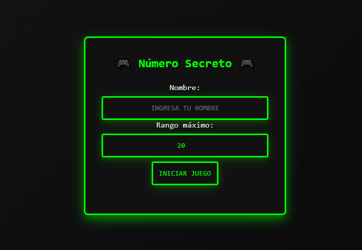

# Juego del Número Secreto 🎲

Un juego interactivo donde debes adivinar un número entre 1 y 20.



## 🎮 Características

- Interfaz responsiva
- Sistema de puntuación
- Almacenamiento local de mejor puntaje
- Retroalimentación visual
- Soporte para tecla Enter

## 🛠️ Tecnologías

- HTML5
- CSS3
- JavaScript 
- LocalStorage API

## 📦 Estructura

```
numero-secreto/
│
├── css/
│   └── styles.css
├── js/
│   └── app.js
├── index.html
└── README.md
```

1. Abre `index.html` en tu navegador

## 🎯 Cómo Jugar

1. Ingresa un número del 1 al 20
2. El juego te dirá si el número es muy alto o muy bajo
3. Intenta adivinar con la menor cantidad de intentos
4. ¡Supera tu mejor puntuación!

## 👤 Autor

Stefany Pérez
- GitHub: [@StefanyPerezBz](https://github.com/StefanyPerezBz)